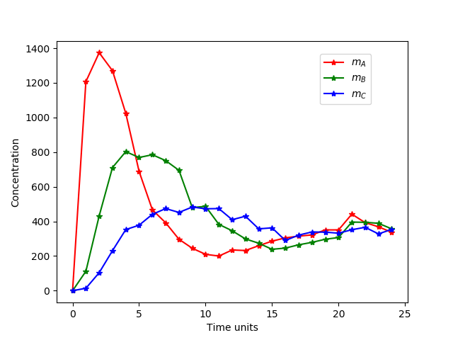
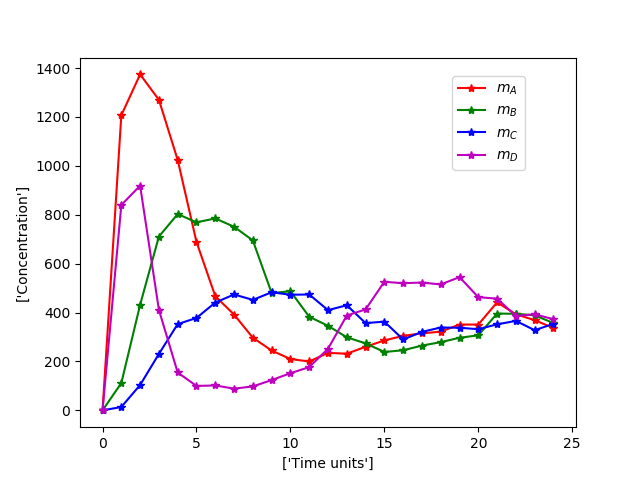
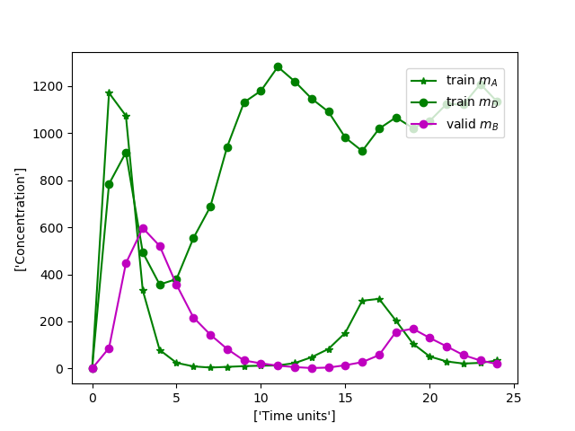

# Protein-mRNA network Parameter Optimization

This projects fits the parameters of the regulatory network showed in the next figure

The equation system proposed is:

The Experimental data that needs to be fit is as shown in the figures bellow:

When *mD* is not considered

When *mD* is considered

Overexpression mutants, transcription.
