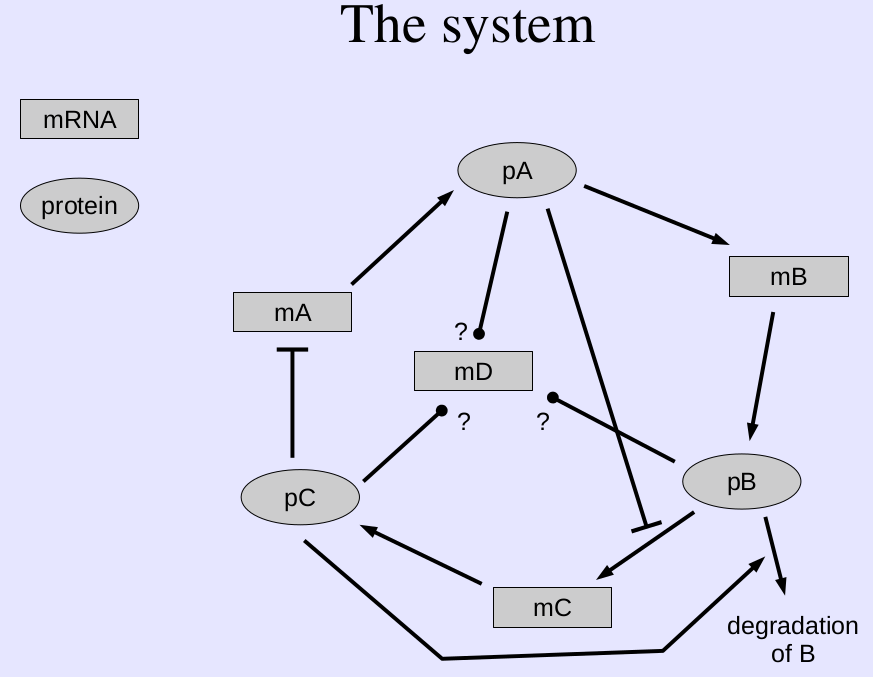

# Protein-mRNA network Parameter Optimization

This projects fits the parameters of the regulatory network showed in the next figure

The equation system proposed is:

To solve it simmulated annealing and genetic algorithms were applied. An example of genetic algorithms can be found .

## Data

The Experimental data that needs to be fit is shown in the figures bellow:

When *mD* is not considered

When *mD* is considered

Overexpression mutants, transcription.

## Results

Using simulated annealing the results obtained are as follows:

