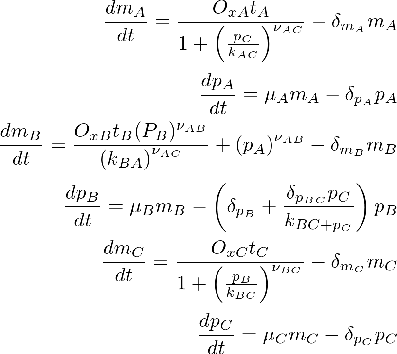

# Protein-mRNA network Parameter Optimization

This projects fits the parameters of a regulatory network 

## Background Data

* mRNA levels can be measured in a variety of ways.
* The same methods can be applied to all sequences.
* Protein levels are much harder to measure
* Mutants give information 
* It is possible to determine where on the DNA a transcription factor binds. Likewise to determine if two proteins interact, etc.
* Mutations are useful to: reveal components involved in a system, indicate causality, hint at how things are regulated. 

## System Description 

* A/B/C form a loop.
* A activates transcription of B.
* B activates transcription of C.
* A represses B’s activation of C.
* C represses transcription of A. 
* C increases degradation of B (which is otherwise slow).
* Other components are degraded by dx/dt = -kx.
* D is regulated by A, B and/or C but the relationship is unknown 
* Hill coefficients in the system are small integers (1 or 2)

The network showed in the next figure

The equation system proposed is:

To solve it simmulated annealing and genetic algorithms were applied. An example of genetic algorithms can be found .

## Data

The Experimental data that needs to be fit is shown in the figures bellow:

When *mD* is not considered

When *mD* is considered

Overexpression mutants, transcription.

## Results

Using simulated annealing the results obtained are as follows:

